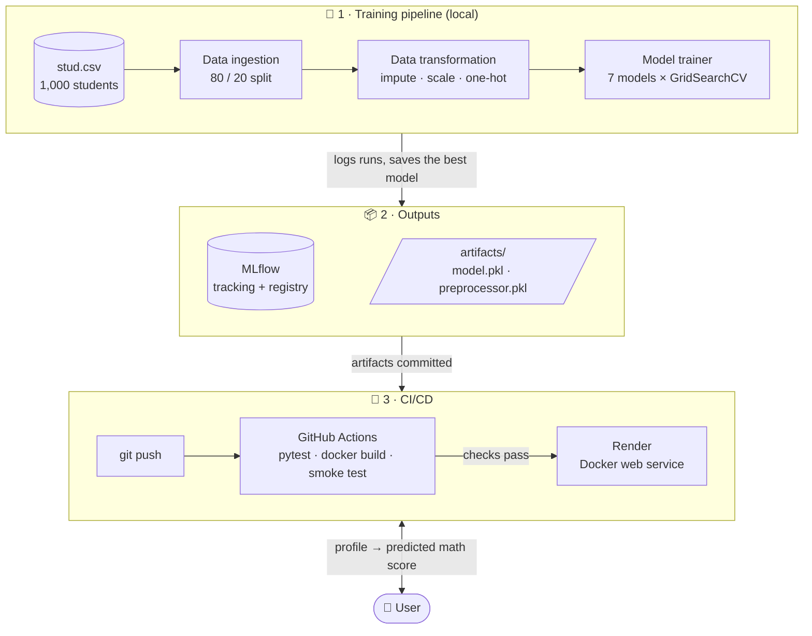
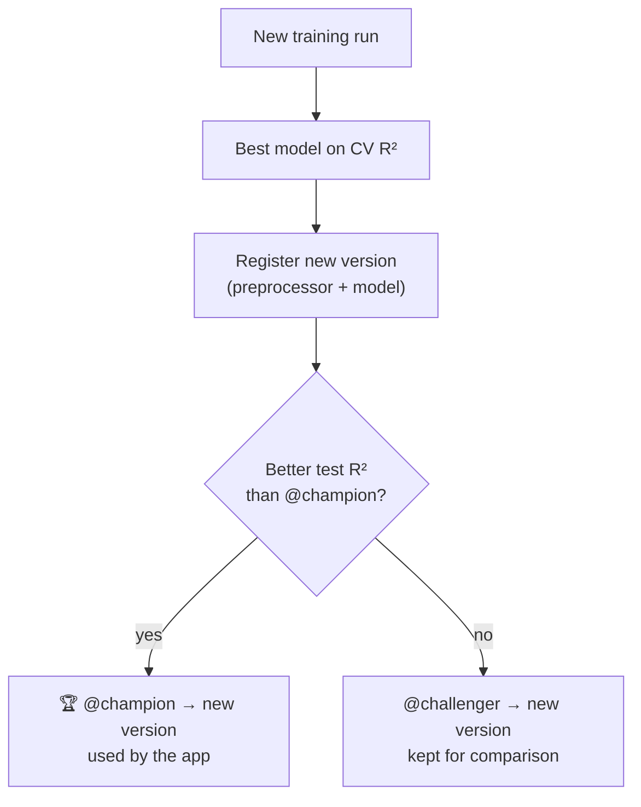

<div align="center">

# 🎓 Student Performance Predictor

**End-to-end Machine Learning project: from exploratory analysis to a tested, containerised and continuously deployed web app.**

Predicts a student's **math score** from their profile and their reading & writing scores.

[](https://github.com/mbarek2002/mlproject/actions/workflows/ci.yml)


🌐 **Live demo:** https://YOUR-SERVICE.onrender.com/predictdata

</div>

---

## 📑 Table of contents

- [Overview](#-overview)
- [Results](#-results)
- [Architecture](#-architecture)
- [How a prediction works](#-how-a-prediction-works)
- [Model registry: champion / challenger](#-model-registry-champion--challenger)
- [Project structure](#-project-structure)
- [Getting started](#-getting-started)
- [Usage](#-usage)
- [Tests & CI/CD](#-tests--cicd)
- [Technical choices](#-technical-choices)

---

## 🔎 Overview

| | |
|---|---|
| **Goal** | Predict `math_score` (0–100), a **regression** problem |
| **Dataset** | [Students Performance in Exams](https://www.kaggle.com/datasets/spscientist/students-performance-in-exams) (Kaggle), 1,000 students, 8 columns |
| **Numerical features** | `reading_score`, `writing_score` |
| **Categorical features** | `gender`, `race_ethnicity`, `parental_level_of_education`, `lunch`, `test_preparation_course` |
| **Best model** | Linear Regression, **R² = 0.878** on the held-out test set |

The project covers the full ML lifecycle:

1. **EDA**: [`notebooks/1 . EDA STUDENT PERFORMANCE .ipynb`](notebooks/)
2. **Modular training pipeline**: ingestion → transformation → training of 7 models with hyperparameter search
3. **Experiment tracking & model registry** with MLflow
4. **Web app** (Flask) with input validation
5. **Automated tests** (pytest)
6. **Docker image** (490 MB, non-root, health check)
7. **CI/CD**: GitHub Actions → Render

---

## 📊 Results

7 models, each tuned with `GridSearchCV` (3-fold cross-validation). **The model is selected on the cross-validation score only**; the test set is used once, for the final evaluation.

| Model | CV R² (selection) | Train R² | Test R² |
|---|:---:|:---:|:---:|
| 🥇 **Linear Regression** | **0.868** | 0.874 | **0.878** |
| Gradient Boosting | 0.852 | 0.895 | 0.877 |
| CatBoost | 0.849 | 0.907 | 0.861 |
| Random Forest | 0.832 | 0.977 | 0.855 |
| AdaBoost | 0.827 | 0.841 | 0.843 |
| XGBoost | 0.825 | 0.929 | 0.849 |
| Decision Tree | 0.708 | 1.000 | 0.757 |

**Takeaways**

- `math_score` is almost **linearly** related to reading and writing scores, so the simplest model wins.
- Tree-based models **overfit**: the Decision Tree reaches R² = 1.000 on train but only 0.757 on test.

---

## 🏗 Architecture



---

## 🔮 How a prediction works


The model is loaded **once** per process and kept in memory: the first request takes ~0.6 s, the next ones ~0.01 s.

---

## 🏆 Model registry: champion / challenger

Each training run registers a new version of `student-math-model`. The version contains **the preprocessor and the model in a single scikit-learn `Pipeline`**, so it takes raw form data as input. The `@champion` alias (used by the app) only moves if the new version is **strictly better**:



---

## 📁 Project structure

```
mlproject/
├── app.py                        # Flask app: /, /predictdata, /health
├── src/
│   ├── components/
│   │   ├── data_ingection.py     # read + train/test split
│   │   ├── data_transformation.py# ColumnTransformer (impute, scale, one-hot)
│   │   └── model_trainer.py      # 7 models, GridSearchCV, MLflow registry
│   ├── pipeline/
│   │   ├── train_pipeline.py     # entry point of the training
│   │   └── predict_pipeline.py   # model loading (registry → .pkl fallback)
│   ├── mlflow_config.py          # tracking URI, experiment, model name, aliases
│   ├── utils.py                  # save / load objects, model evaluation
│   ├── logger.py                 # timestamped log files in logs/
│   └── exception.py              # CustomException with file + line number
├── templates/                    # HTML pages (Bootstrap 5)
├── artifacts/                    # model.pkl, preprocessor.pkl, train/test CSV
├── notebooks/                    # EDA + model training notebooks, raw data
├── tests/                        # pytest suite
├── Dockerfile                    # production image
├── render.yaml                   # Render deployment blueprint
├── .github/workflows/ci.yml      # CI: tests + docker build + smoke test
├── requirements.txt              # training dependencies (pinned)
├── requirements-prod.txt         # serving dependencies only (Docker image)
└── requirements-dev.txt          # + pytest
```

---

## 🚀 Getting started

**Prerequisites:** Python 3.8, and Docker (optional).

```bash
git clone https://github.com/mbarek2002/mlproject.git
cd mlproject

# with conda
conda create -p ./venv python=3.8 -y
conda activate ./venv

# or with venv
python -m venv venv
source venv/bin/activate        # Windows: venv\Scripts\activate

pip install -r requirements-dev.txt
```

---

## 🛠 Usage

### Train the models

```bash
python -m src.pipeline.train_pipeline
```

This runs the full pipeline, writes `artifacts/`, logs every model in MLflow and registers the best one.

### Explore the experiments in MLflow

```bash
python -m mlflow ui --backend-store-uri sqlite:///mlflow.db --port 5001
```

Then open http://127.0.0.1:5001. **Experiments** compares the runs and **Models** shows the versions and the aliases.

### Run the web app

```bash
python app.py
```

Then open http://127.0.0.1:5000/predictdata.

### Run with Docker

```bash
docker build -t student-performance .
docker run -d --name student-app -p 8501:5000 student-performance
```

Then open http://127.0.0.1:8501/predictdata.

---

## ✅ Tests & CI/CD

```bash
pytest -v
```

**20 tests** cover the preprocessing, the prediction pipeline and the web app. Among them:

- invalid forms return a **400** with a clear message (never a 500);
- reading and writing scores are **not swapped** between the form and the model;
- the `.pkl` fallback works when the MLflow registry is unavailable.

**On every push to `main`**, GitHub Actions:

1. runs the tests in `python:3.8-slim`, with the exact production dependencies;
2. builds the Docker image, which **fails if the model cannot be loaded**;
3. starts the container and runs a **smoke test** (`/health` + a real prediction).

**Render deploys only once these checks pass** (`autoDeployTrigger: checksPass`).

---

## 🧠 Technical choices

| Choice | Why |
|---|---|
| Model selected on **CV R²**, not test R² | The test set stays an unbiased estimate of real performance |
| **Preprocessor + model** registered as one `Pipeline` | A registry version is self-contained: raw input in, prediction out |
| **Champion / challenger** aliases | A worse retraining can never replace the model in production |
| **`.pkl` fallback** | The app keeps working if MLflow is unavailable (as in Docker / Render) |
| **Pinned versions** | A pickled model must be loaded with the scikit-learn version that created it |
| **Separate `requirements-prod.txt`** | No XGBoost / CatBoost in the image: **2 GB → 490 MB** |
| **waitress + tini**, non-root user | Production WSGI server, clean shutdown, least privilege |

---

<div align="center">

**Iheb Mbarek** · [GitHub @mbarek2002](https://github.com/mbarek2002)

</div>
