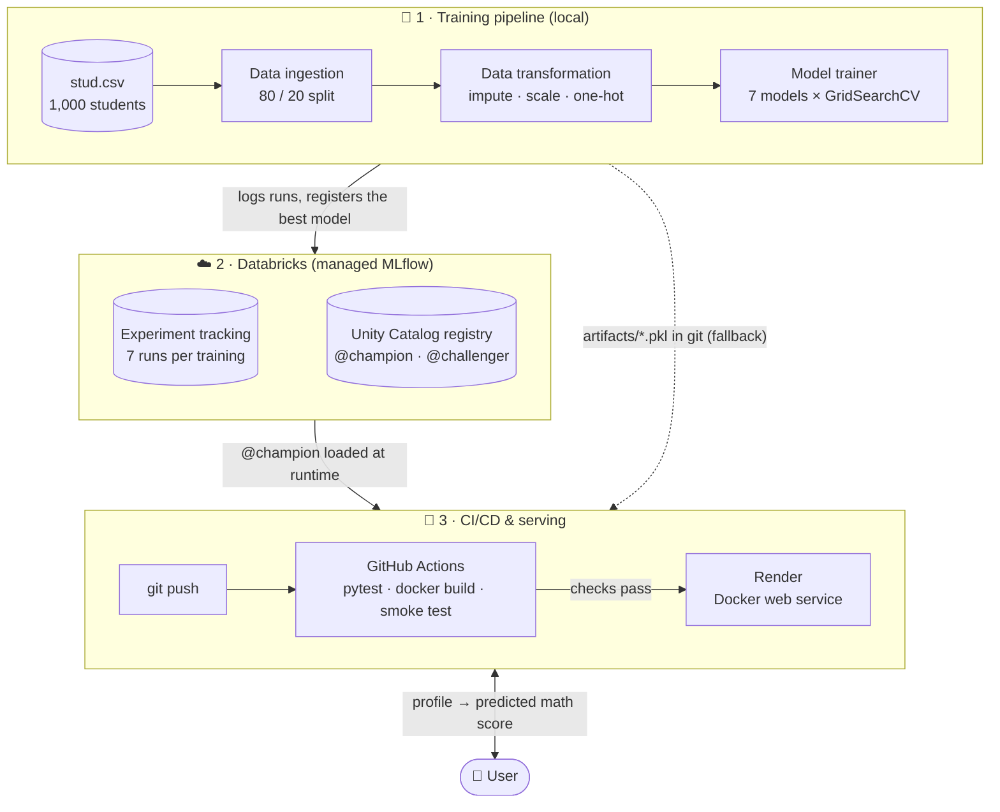
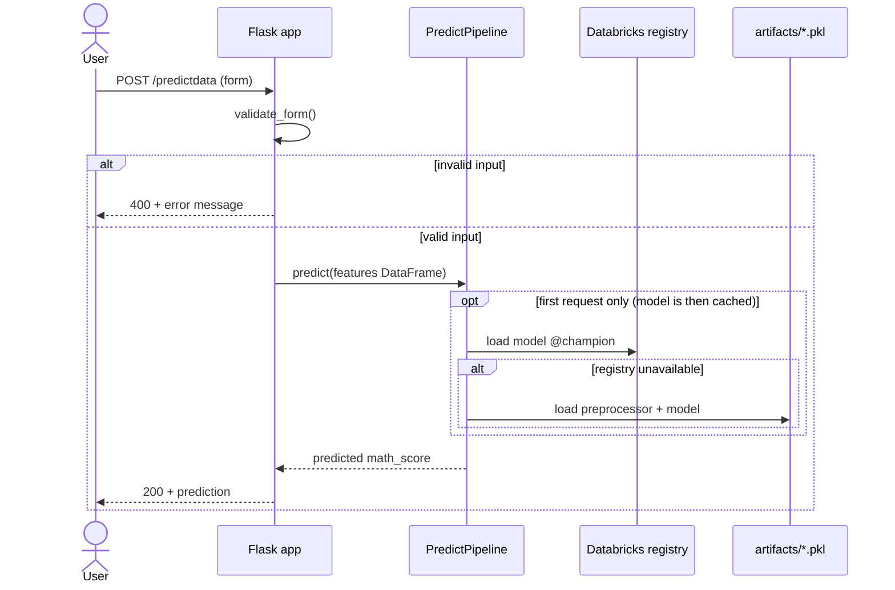
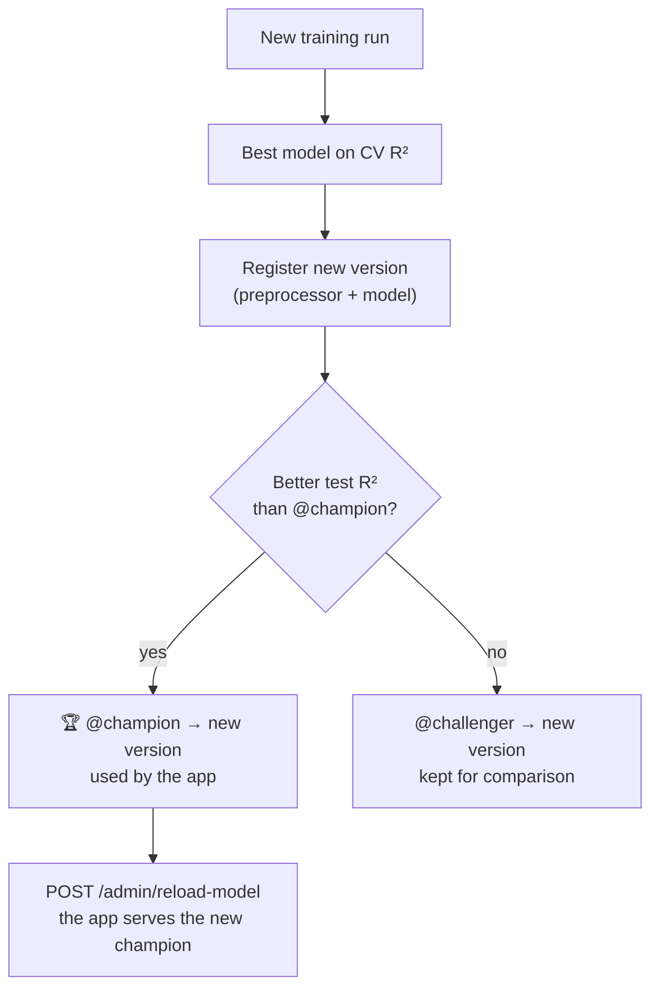
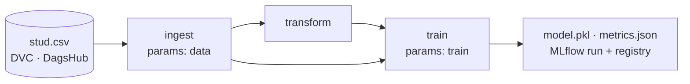
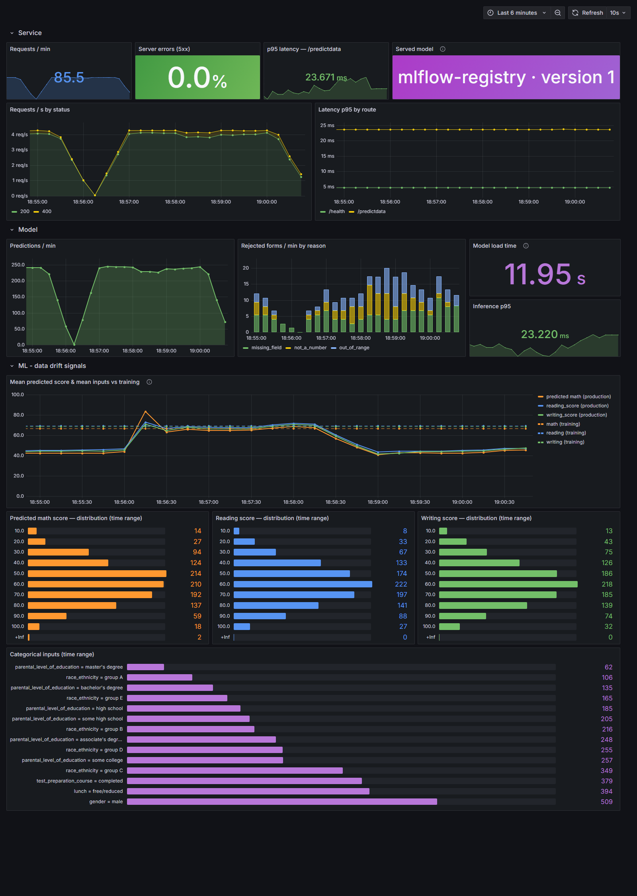

<div align="center">

# 🎓 Student Performance Predictor

**End-to-end Machine Learning project: from exploratory analysis to a tested, containerised and continuously deployed web app.**

Predicts a student's **math score** from their profile and their reading & writing scores.

[](https://github.com/mbarek2002/mlproject/actions/workflows/ci.yml)


🌐 **Live demo:** https://student-performance-cgcd.onrender.com/predictdata

<sub>Free Render instance: the first visit after 15 min of inactivity can take ~1 min (cold start).</sub>

</div>

---

## 📑 Table of contents

- [Overview](#-overview)
- [Results](#-results)
- [Architecture](#-architecture)
- [How a prediction works](#-how-a-prediction-works)
- [Model registry: champion / challenger](#-model-registry-champion--challenger)
- [Project structure](#-project-structure)
- [Getting started](#-getting-started)
- [Configuration: local or Databricks registry](#-configuration-local-or-databricks-registry)
- [Data & pipeline versioning (DVC)](#-data--pipeline-versioning-dvc)
- [Usage](#-usage)
- [Monitoring (Prometheus + Grafana)](#-monitoring-prometheus--grafana)
- [Tests & CI/CD](#-tests--cicd)
- [Technical choices](#-technical-choices)

---

## 🔎 Overview

| | |
|---|---|
| **Goal** | Predict `math_score` (0–100), a **regression** problem |
| **Dataset** | [Students Performance in Exams](https://www.kaggle.com/datasets/spscientist/students-performance-in-exams) (Kaggle), 1,000 students, 8 columns |
| **Numerical features** | `reading_score`, `writing_score` |
| **Categorical features** | `gender`, `race_ethnicity`, `parental_level_of_education`, `lunch`, `test_preparation_course` |
| **Best model** | Linear Regression, **R² = 0.878** on the held-out test set |

The project covers the full ML lifecycle:

1. **EDA**: [`notebooks/1 . EDA STUDENT PERFORMANCE .ipynb`](notebooks/)
2. **Modular training pipeline**: ingestion → transformation → training of 7 models with hyperparameter search, orchestrated and versioned with **DVC** (data stored on **DagsHub**)
3. **Experiment tracking & model registry** with MLflow, hosted on **Databricks (Unity Catalog)**
4. **Web app** (Flask) with input validation, serving the registry's `@champion` model
5. **Automated tests** (pytest)
6. **Docker image** (490 MB, non-root, health check)
7. **CI/CD**: GitHub Actions → Render
8. **Monitoring**: Prometheus metrics + Grafana dashboard (service health, served model, **data drift signals**)

A new model goes live **without redeploying**: training promotes it to `@champion` in Databricks, then the app reloads it.

---

## 📊 Results

7 models, each tuned with `GridSearchCV` (3-fold cross-validation). **The model is selected on the cross-validation score only**; the test set is used once, for the final evaluation.

| Model | CV R² (selection) | Train R² | Test R² |
|---|:---:|:---:|:---:|
| 🥇 **Linear Regression** | **0.868** | 0.874 | **0.878** |
| Gradient Boosting | 0.852 | 0.895 | 0.877 |
| CatBoost | 0.849 | 0.907 | 0.861 |
| Random Forest | 0.832 | 0.977 | 0.855 |
| AdaBoost | 0.827 | 0.841 | 0.843 |
| XGBoost | 0.825 | 0.929 | 0.849 |
| Decision Tree | 0.708 | 1.000 | 0.757 |

**Takeaways**

- `math_score` is almost **linearly** related to reading and writing scores, so the simplest model wins.
- Tree-based models **overfit**: the Decision Tree reaches R² = 1.000 on train but only 0.757 on test.

---

## 🏗 Architecture



- **Code changes** go live through `git push` → CI → Render.
- **Model changes** go live through the registry: no commit, no image rebuild.

---

## 🔮 How a prediction works



The model is loaded **once** per process and kept in memory: the first request downloads it from Databricks (~10 s), the next ones take ~0.01 s.

`GET /health` shows which model is served:

```json
{"status": "ok", "model": {"source": "mlflow-registry", "model": "workspace.default.student_math_model", "alias": "champion", "version": "1"}}
```

`"source": "pickle-fallback"` means the registry could not be reached and the app serves `artifacts/*.pkl`.

---

## 🏆 Model registry: champion / challenger

Each training run registers a new version of `workspace.default.student_math_model` in **Databricks Unity Catalog**. The version contains **the preprocessor and the model in a single scikit-learn `Pipeline`**, with its input signature, so it takes raw form data as input. The `@champion` alias (used by the app) only moves if the new version is **strictly better**:



---

## 📁 Project structure

```
mlproject/
├── app.py                        # Flask app: /, /predictdata, /health, /metrics, /admin/reload-model
├── src/
│   ├── components/
│   │   ├── data_ingection.py     # read + train/test split
│   │   ├── data_transformation.py# ColumnTransformer (impute, scale, one-hot)
│   │   └── model_trainer.py      # 7 models, GridSearchCV, MLflow registry
│   ├── pipeline/
│   │   ├── stages.py             # DVC stages: ingest, transform, train (+ MLflow lineage)
│   │   ├── train_pipeline.py     # the 3 stages in one process, without DVC
│   │   └── predict_pipeline.py   # model loading (registry → .pkl fallback)
│   ├── mlflow_config.py          # tracking / registry URIs, experiment, model name (from env)
│   ├── monitoring.py             # Prometheus metrics (service, model, data drift)
│   ├── utils.py                  # save / load objects, model evaluation
│   ├── logger.py                 # timestamped log files in logs/
│   └── exception.py              # CustomException with file + line number
├── templates/                    # HTML pages (Bootstrap 5)
├── artifacts/                    # model.pkl, preprocessor.pkl (git) + intermediate data (DVC)
├── notebooks/                    # EDA + model training notebooks, raw data (stud.csv.dvc)
├── dvc.yaml · dvc.lock           # DVC pipeline and its locked hashes
├── params.yaml                   # split, CV and hyperparameter grids
├── metrics.json                  # last training metrics (dvc metrics show)
├── tests/                        # pytest suite
├── monitoring/                   # Prometheus config, Grafana datasource + dashboard (as code)
├── scripts/generate_traffic.py   # traffic simulator (with optional data drift)
├── docker-compose.yml            # local stack: app + Prometheus + Grafana
├── docs/                         # architecture diagram (draw.io), dashboard screenshot
├── .env.example                  # template for Databricks credentials (.env is git-ignored)
├── Dockerfile                    # production image
├── render.yaml                   # Render deployment blueprint
├── .github/workflows/ci.yml      # CI: tests + docker build + smoke test
├── requirements.txt              # training dependencies (pinned)
├── requirements-prod.txt         # serving dependencies only (Docker image)
└── requirements-dev.txt          # + pytest
```

---

## 🚀 Getting started

**Prerequisites:** Python 3.8, and Docker (optional).

```bash
git clone https://github.com/mbarek2002/mlproject.git
cd mlproject

# with conda
conda create -p ./venv python=3.8 -y
conda activate ./venv

# or with venv
python -m venv venv
source venv/bin/activate        # Windows: venv\Scripts\activate

pip install -r requirements-dev.txt
```

---

## ⚙️ Configuration: local or Databricks registry

The MLflow location is read from environment variables, loaded from a **`.env`** file in local development.

| Mode | When | Tracking & registry |
|---|---|---|
| **Local** | no `.env` (default) | SQLite file `mlflow.db` |
| **Databricks** | `.env` filled from `.env.example` | Databricks MLflow + Unity Catalog |

To use Databricks ([Free Edition](https://www.databricks.com/learn/free-edition) works):

1. Create a **personal access token**: *Settings → Developer → Access tokens*.
2. Copy `.env.example` to `.env` and fill it in:

| Variable | Example |
|---|---|
| `DATABRICKS_HOST` | `https://dbc-xxxx.cloud.databricks.com` |
| `DATABRICKS_TOKEN` | `dapi...` (secret) |
| `MLFLOW_TRACKING_URI` | `databricks` |
| `MLFLOW_REGISTRY_URI` | `databricks-uc` |
| `MLFLOW_EXPERIMENT_NAME` | `/Users/<email>/student-performance` (training only) |
| `MLFLOW_REGISTERED_MODEL_NAME` | `workspace.default.student_math_model` |
| `RELOAD_TOKEN` | random string protecting `/admin/reload-model` (secret) |

3. In production, set the same variables in **Render → Environment** (`MLFLOW_EXPERIMENT_NAME` is not needed).

> 🔒 `.env` is git-ignored and excluded from the Docker image: secrets only reach the app as environment variables.

---

## 🗂 Data & pipeline versioning (DVC)

The raw dataset and the training pipeline are versioned with [DVC](https://dvc.org). The data itself lives on **DagsHub**; git only keeps a small pointer file (`stud.csv.dvc`) with its hash.



| File | Role |
|---|---|
| `dvc.yaml` | The 3 stages, with their inputs (data, code, params) and outputs |
| `dvc.lock` | Hashes of every input and output of the last run (commit it) |
| `params.yaml` | Split parameters, CV folds and **all hyperparameter grids** (no longer hardcoded) |
| `metrics.json` | Best model and its CV / test R², compared with `dvc metrics diff` |
| `notebooks/data/stud.csv.dvc` | Pointer to the dataset version stored on DagsHub |

**Lineage:** each MLflow run is tagged with the DVC hash of the dataset (`data.dvc_md5`) and the git commit, and stores `params.yaml`. Any model in the registry can be traced back to the exact data, code and parameters that produced it.

`artifacts/model.pkl` and `preprocessor.pkl` stay in git (`cache: false`): the Docker image embeds them as the fallback model.

**Getting the data** (after cloning):

```bash
dvc remote modify origin --local auth basic
dvc remote modify origin --local user <dagshub-user>
dvc remote modify origin --local password <dagshub-token>
dvc pull
```

---

## 🛠 Usage

### Train the models

```bash
dvc repro
```

DVC runs only the stages whose inputs changed: editing `train.cv_folds` in `params.yaml` re-runs `train` only, and running it again with no change does nothing. The best model is logged and registered in MLflow (local or Databricks, depending on the configuration).

Useful commands: `dvc dag` (pipeline graph), `dvc params diff`, `dvc metrics show`, and `python -m src.pipeline.train_pipeline` to run the 3 stages in one process without DVC.

### Explore the experiments

- **Databricks:** *Experiments → student-performance* for the runs, *Catalog → workspace → default → Models* for the versions and aliases.
- **Local:**

  ```bash
  python -m mlflow ui --backend-store-uri sqlite:///mlflow.db --port 5001
  ```

  Then open http://127.0.0.1:5001.

### Put a new champion online (no redeploy)

After a training run that promoted a new `@champion`:

```bash
curl -X POST https://student-performance-cgcd.onrender.com/admin/reload-model \
     -H "Authorization: Bearer $RELOAD_TOKEN"
```

The app loads the new version and returns it. Without the right token it answers `401`, and without `RELOAD_TOKEN` configured the route is disabled (`404`). Restarting the service on Render has the same effect.

### Run the web app

```bash
python app.py
```

Then open http://127.0.0.1:5000/predictdata.

### Run with Docker

```bash
docker build -t student-performance .
docker run -d --name student-app --env-file .env -p 8501:5000 student-performance
```

Then open http://127.0.0.1:8501/predictdata. Without `--env-file .env`, the container serves the `.pkl` fallback.

---

## 📈 Monitoring (Prometheus + Grafana)

The app exposes Prometheus metrics on `GET /metrics`; a local stack scrapes them every 15 s and shows them in a provisioned Grafana dashboard.



*Simulated traffic: normal inputs first (production means overlap the dashed training means), then inputs 25 points lower. The drift is immediately visible.*

| Group | Metrics | Question answered |
|---|---|---|
| **Service** | `http_requests_total{endpoint,status}`, `http_request_duration_seconds` | Is the API up, fast and error-free? |
| **Model** | `model_info{source,version}`, `model_load_seconds`, `predictions_total`, `prediction_duration_seconds`, `invalid_requests_total{reason}` | Which model is served (registry or fallback)? How fast is inference? |
| **ML: drift signals** | `predicted_math_score`, `input_score{feature}` (histograms), `input_category_total{feature,value}` | Do production inputs and predictions still look like the training data? |

**Run it locally:**

```bash
docker compose up -d --build          # app + Prometheus + Grafana
python scripts/generate_traffic.py    # realistic traffic (add --drift 25 to simulate drift)
```

| Service | URL |
|---|---|
| App | http://127.0.0.1:8501 |
| Prometheus | http://127.0.0.1:9090 |
| Grafana | http://127.0.0.1:3001 (dashboard *MLOps → Student Performance*, read-only; `admin` / `admin` to edit) |

Everything is **configuration as code**: `monitoring/prometheus/prometheus.yml`, the Grafana datasource and the dashboard (`monitoring/grafana/`) are versioned and provisioned at startup. Stop the stack with `docker compose down`.

`/metrics` is public by default. Set `METRICS_TOKEN` (e.g. on Render) to require `Authorization: Bearer <token>`.

---

## ✅ Tests & CI/CD

```bash
pytest -v
```

**35 tests** cover the preprocessing, the prediction pipeline, the web app and the metrics. Among them:

- invalid forms return a **400** with a clear message (never a 500);
- reading and writing scores are **not swapped** between the form and the model;
- the `.pkl` fallback works when the MLflow registry is unavailable;
- `/admin/reload-model` rejects missing or wrong tokens;
- every prediction updates the model and data-drift metrics, and unknown URLs never create new metric series.

Tests always run against the **local** registry, even when a `.env` points to Databricks: they are fast, offline and give the same result on every machine.

**On every push to `main`**, GitHub Actions:

1. pulls the dataset from DagsHub with `dvc pull`, then runs the tests in `python:3.8-slim`, with the exact production dependencies;
2. builds the Docker image, which **fails if the model cannot be loaded**;
3. starts the container and runs a **smoke test** (`/health` + a real prediction).

**Render deploys only once these checks pass** (`autoDeployTrigger: checksPass`).

---

## 🧠 Technical choices

| Choice | Why |
|---|---|
| Model selected on **CV R²**, not test R² | The test set stays an unbiased estimate of real performance |
| **Preprocessor + model** registered as one `Pipeline` | A registry version is self-contained: raw input in, prediction out |
| **Champion / challenger** aliases | A worse retraining can never replace the model in production |
| **Databricks Unity Catalog** as registry | A shared, managed registry: the deployed app reads the same `@champion` as the training |
| **Training locally, registry remotely** | No Databricks compute used; the training code is unchanged |
| **Hot reload** behind a token | New models go live in seconds, without a commit or an image rebuild |
| **`.pkl` fallback** + short MLflow timeouts | The app keeps working (and never hangs) if Databricks is unreachable |
| **Drift signals as Prometheus histograms** | Input and prediction distributions compared live with the training means, without storing raw requests |
| Metric labels from **route patterns only** | Bounded number of series: random URLs can't blow up Prometheus |
| Configuration through **environment variables** | Same code and image everywhere; secrets never in git nor in the image |
| **Pinned versions** | A pickled model must be loaded with the scikit-learn version that created it |
| **Separate `requirements-prod.txt`** | No XGBoost / CatBoost in the image: **2 GB → 490 MB** |
| **waitress + tini**, non-root user | Production WSGI server, clean shutdown, least privilege |

---

<div align="center">

**Iheb Mbarek** · [GitHub @mbarek2002](https://github.com/mbarek2002)

</div>
